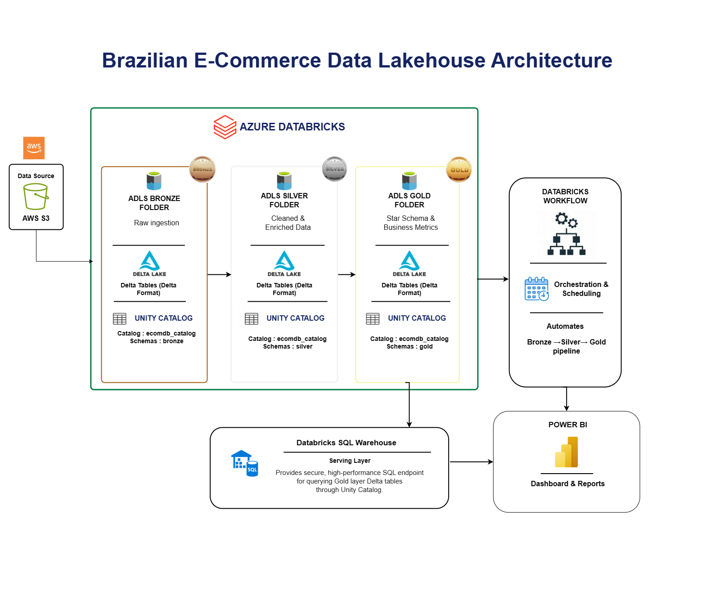
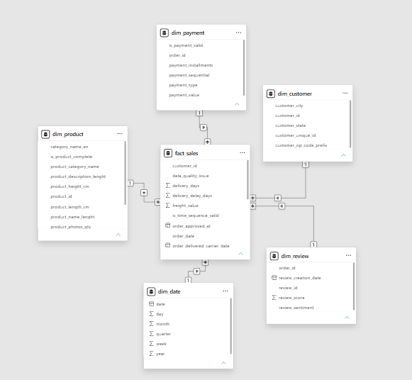
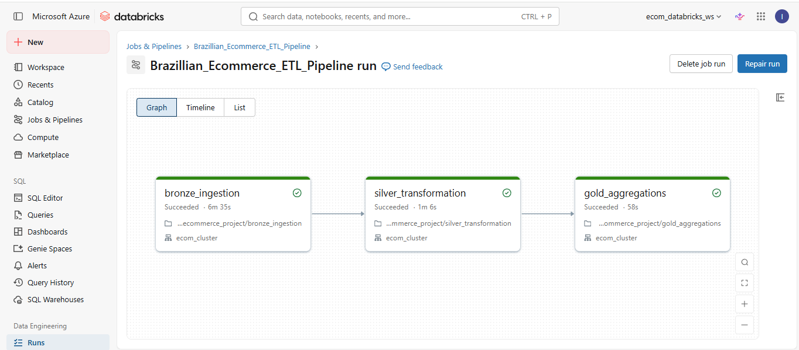
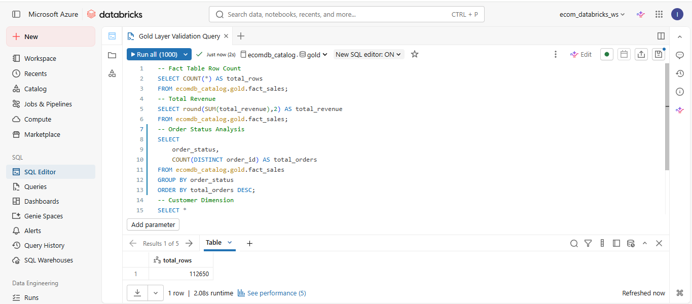
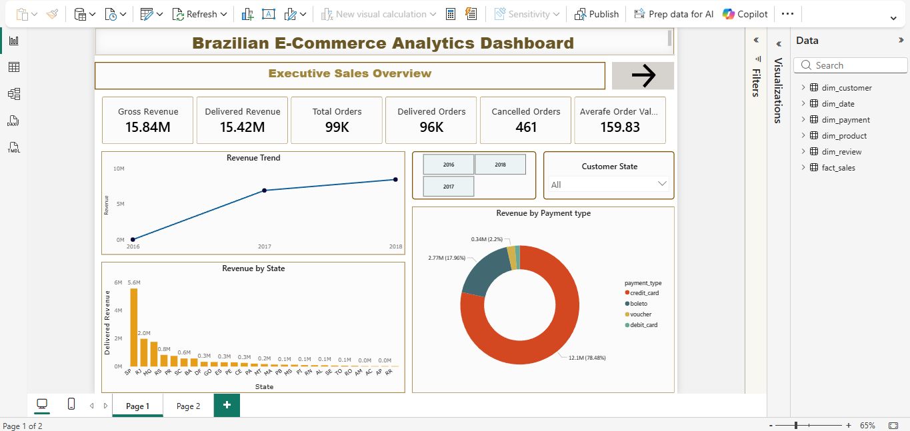
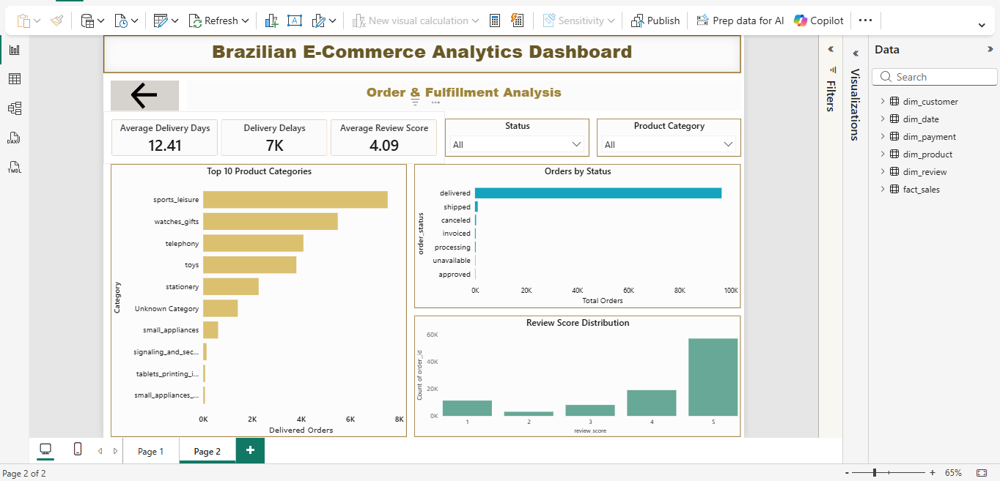

# Brazilian E-Commerce Lakehouse

## Project Overview

This project demonstrates the implementation of an end-to-end Azure Databricks Lakehouse solution using the Medallion Architecture (Bronze, Silver, Gold).

The solution ingests Brazilian E-Commerce data from AWS S3, processes and transforms data using PySpark in Azure Databricks, stores Delta tables in Azure Data Lake Storage Gen2, manages governance through Unity Catalog, orchestrates pipelines using Databricks Workflows, serves data through Databricks SQL Warehouse, and visualizes insights using Power BI.

---
## Project Highlights

- Implemented Medallion Architecture
- Built Delta Lake tables using PySpark
- Managed governance with Unity Catalog
- Developed ETL pipelines in Azure Databricks
- Automated workflows using Databricks Workflows
- Created Star Schema dimensional models
- Connected Databricks SQL Warehouse to Power BI
- Built business intelligence dashboards
---

## Architecture Diagram



### Architecture Flow

```text
AWS S3
   ↓
Bronze Layer (Raw Data)
   ↓
Silver Layer (Cleaned & Enriched Data)
   ↓
Gold Layer (Star Schema & Business Metrics)
   ↓
Databricks SQL Warehouse
   ↓
Power BI Dashboard
```
---

## Technology Stack

| Component | Technology |
|------------|------------|
| Source | AWS S3 |
| Cloud Platform | Microsoft Azure |
| Processing | Azure Databricks |
| Storage | Azure Data Lake Storage Gen2 |
| Data Format | Delta Lake |
| Governance | Unity Catalog |
| Orchestration | Databricks Workflows |
| Serving Layer | Databricks SQL Warehouse |
| Visualization | Power BI |
| Programming | PySpark, SQL |

---

## Dataset

Brazilian E-Commerce Public Dataset containing:

- Customers
- Orders
- Products
- Order Items
- Payments
- Reviews
- Product Category Translation

---

## Medallion Architecture

### Bronze Layer

Purpose:
Store raw source data without modification.

Activities:

- Data ingestion from AWS S3
- Schema preservation
- Delta table creation

Output:

- Raw Delta Tables

---

### Silver Layer

Purpose:
Clean, standardize, and enrich data.

Activities:

- Data cleansing
- Null handling
- Data type conversions
- Duplicate removal
- Sentiment analysis on customer reviews
- Business rule implementation

Output:

- Cleaned and enriched Delta Tables

---

### Gold Layer

Purpose:
Provide business-ready analytical datasets.

Activities:

- Star schema implementation
- Fact and dimension modeling
- KPI preparation

Output:

- Analytics-ready Delta Tables

---

## Data Model

The Gold layer follows a Star Schema design optimized for analytical workloads and reporting.

### Star Schema



### Fact Table

- fact_sales

### Dimension Tables

- dim_customer
- dim_product
- dim_payment
- dim_review
- dim_date

---

## Databricks Workflow

The complete pipeline is orchestrated using Databricks Workflows.

Workflow Sequence:

```text
Bronze Ingestion
      ↓
Silver Transformation
      ↓
Gold Modeling
```


---

## Databricks SQL Warehouse

Databricks SQL Warehouse serves as the analytics layer for reporting and dashboarding.

Features:

- High-performance SQL querying
- Unity Catalog integration
- Power BI connectivity




---

## Power BI Dashboard

### Executive Sales Overview

Features:

- Gross Revenue
- Delivered Revenue
- Total Orders
- Delivered Orders
- Cancelled Orders
- Average Order Value
- Revenue Trend
- Revenue by State
- Revenue by Payment Type



---

### Order & Fulfillment Analysis

Features:

- Average Delivery Days
- Delivery Delays
- Average Review Score
- Orders by Status
- Product Category Analysis
- Review Score Distribution



---

## Key Business Metrics

- Gross Revenue
- Delivered Revenue
- Total Orders
- Delivered Orders
- Cancelled Orders
- Average Order Value
- Average Delivery Days
- Average Review Score

---

## Repository Structure

```text
Brazilian-Ecommerce-Lakehouse/
│
├── Architecture/
│   └── architecture.png
│
├── Bronze/
├── Silver/
├── Gold/
│
├── Workflow/
│   └── workflow.png
│
├── Screenshots/
│   └── sql_warehouse.png
|
├── Dashboard/
│   ├── page1.png
│   └── page2.png
│
└── README.md
```
## Conclusion

This project demonstrates the design and implementation of a modern Lakehouse architecture using Azure Databricks. It covers the complete data lifecycle from ingestion and transformation to analytics and visualization, following industry-standard data engineering practices.

---

## Author

Iswarya Selvakumar

Azure Databricks | PySpark | Delta Lake | Data Engineering
